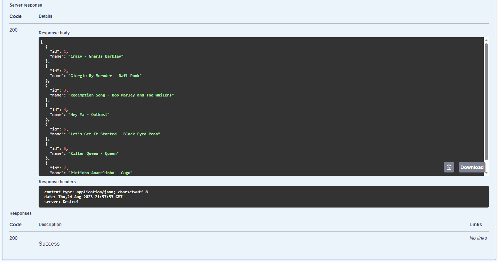
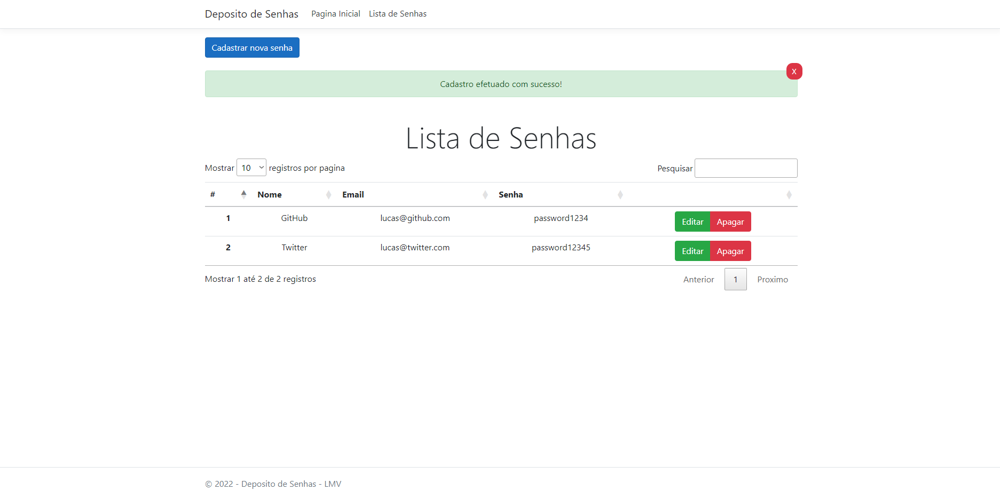
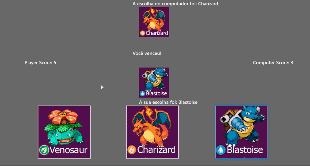
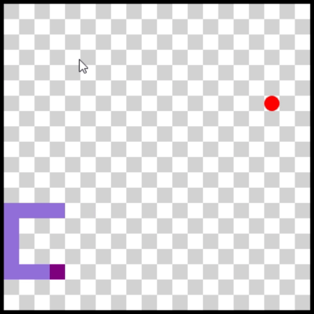
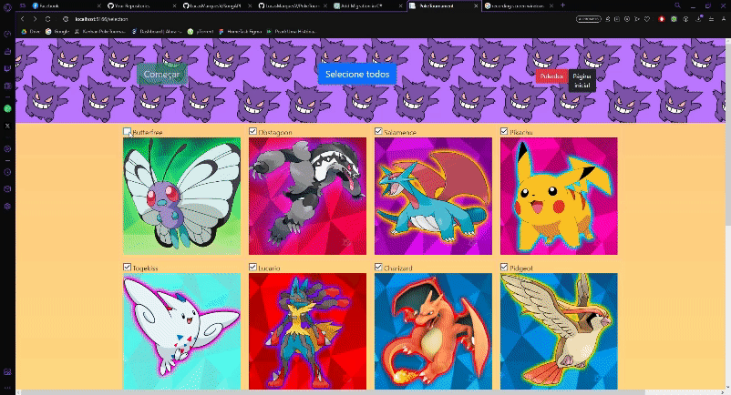

<h2 align="center" > 💻👨‍💻 Hey, I'm Lucas! Backend developer from São Paulo - Brazil! 👨‍💻💻</h2>
<h3 >Currently working for T-Systems (Deutsche Telekom) as a C# Software Developer Intern, learning and getting better every day. On my way to becoming a full-stack developer!

Extremely communicative and I'm nearly always listening to music (about 36% of the time). I also love cooking with my fiancee and running in the park with my dog, Ravioli. </h3>
<h2></h2>

<h3 align="left">Social Media:</h3>

<h3 align="left"> Main learning languages:</h3>

     

<h2 align="left"> Some projects:</h2>

 🟢 SongAPI CRUD - C# - ASP.NET API 🟢 [Finished] 
 
My first Web API works as a CRUD API with an SQL database, and all requests are made through Swagger. It's essentially an application that allows you to register, read, and list songs. Additionally, it can create, update, and delete them.

Listing the songs:

 

 🟢 PasswordStorage CRUD - C#  - ASP.NET APP 🟢 [Finished] 
 
My first web app works as a CRUD application built with MVC using an SQL database. It's essentially an application that registers, reads, and lists logins and passwords. Additionally, it can create, update, and delete them.

Listing the passwords after creating a new one:

 

🟢 PokePaperScissors - C# - Windows Forms 🟢 [Finished] 
 
It's a Windows Form application. Simply the classic Rock, Paper Scissors but with the 3 initial Pokemons from the first gen.

 

 🟢 SnakeGame - C#  - Windows Forms 🟢 [Finished] 
 
The old fashioned nostalgic Snake Game made on Windows Forms.

 

 🟡  PokeTournament - C#  - ASP.NET APP 🟡 [Stable/On Going] 
 
A Tournament made with 16 different types of Pokemons with a simple and random logic so everyone of them can win in each one of the matches, only depending on the random oponent.

First test result:

Second test result:

 

